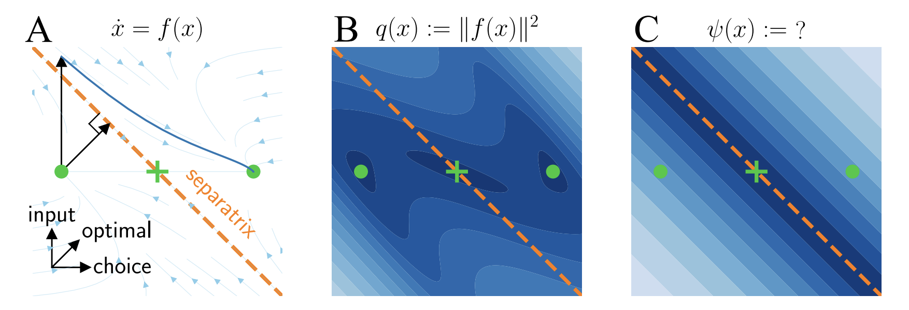

### Abstract

We introduce a numerical framework to characterize separatrices in high-dimensional dynamical systems, combining Koopman Theory and Deep Neural Networks. Our method approximates Koopman Eigenfunctions that vanish at separatrices, enabling efficient location of these boundaries between basins of attraction. We demonstrate applications to ecological networks and neuroscience-inspired recurrent neural networks, including optimal perturbation design for crossing separatrices.

---

##### Citation 

Dabholkar, Kabir V., and Omri Barak. "Finding separatrices of dynamical flows with Deep Koopman Eigenfunctions." arXiv preprint arXiv:2505.15231 (2025).

```BibTeX
@article{dabholkar2025finding,
  title={Finding separatrices of dynamical flows with Deep Koopman Eigenfunctions},
  author={Dabholkar, Kabir V and Barak, Omri},
  journal={arXiv preprint arXiv:2505.15231},
  year={2025}
}
```
