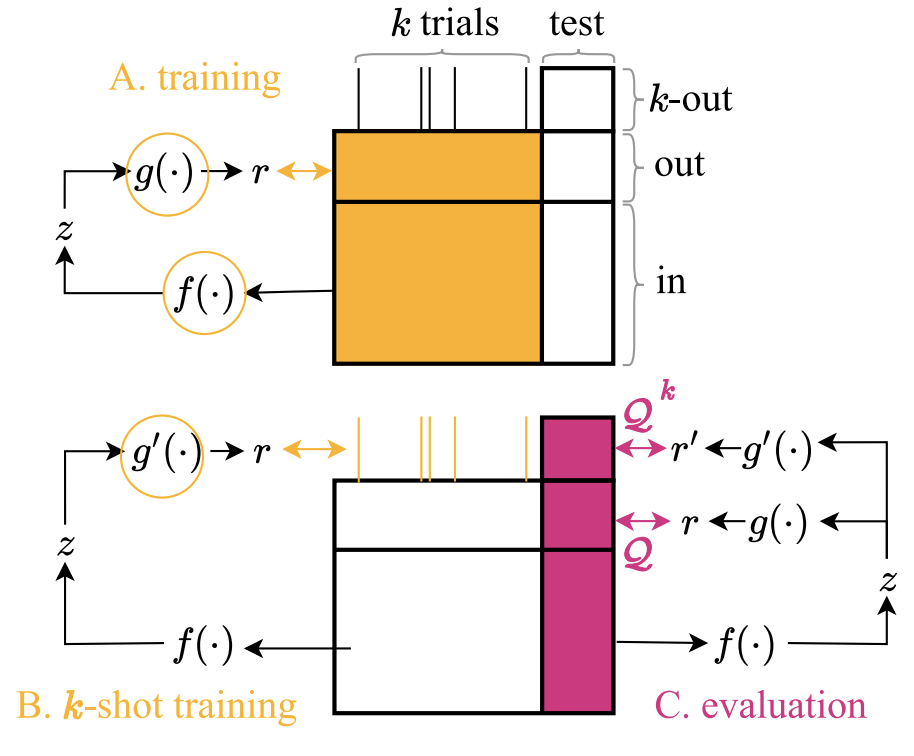

---

### Abstract

Latent variable models serve as powerful tools to infer underlying dynamics from observed neural activity. Ideally, the inferred dynamics should align with true ones. However, due to the absence of ground truth data, prediction benchmarks are often employed as proxies. One widely-used method, *co-smoothing*, involves jointly estimating latent variables and predicting observations along held-out channels to assess model performance. In this study, we reveal the limitations of the co-smoothing prediction framework and propose a remedy. In a student-teacher setup with Hidden Markov Models, we demonstrate that the high co-smoothing model space encompasses models with arbitrary extraneous dynamics in their latent representations. To address this, we introduce a secondary metric — *few-shot co-smoothing*, performing regression from the latent variables to held-out channels in the data using fewer trials. Our results indicate that among models with near-optimal co-smoothing, those with extraneous dynamics underperform in the few-shot co-smoothing compared to `minimal' models that are devoid of such dynamics. We provide analytical insights into the origin of this phenomenon and further validate our findings on real neural data using two state-of-the-art methods: LFADS and STNDT. In the absence of ground truth, we suggest a novel measure to validate our approach. By cross-decoding the latent variables of all model pairs with high co-smoothing, we identify models with minimal extraneous dynamics. We find a correlation between few-shot co-smoothing performance and this new measure. In summary, we present a novel prediction metric designed to yield latent variables that more accurately reflect the ground truth, offering a significant improvement for latent dynamics inference.

---

##### Citation 

Dabholkar, Kabir V., and Omri Barak. "When predict can also explain: few-shot prediction to select better neural latents." [PLACEHOLDER] Journal/Conference (2024).

```BibTeX
@article{dabholkar2024predict,
  title={When predict can also explain: few-shot prediction to select better neural latents},
  author={Dabholkar, Kabir and Barak, Omri},
  journal={arXiv preprint arXiv:2405.14425},
  year={2024}
}
``` 